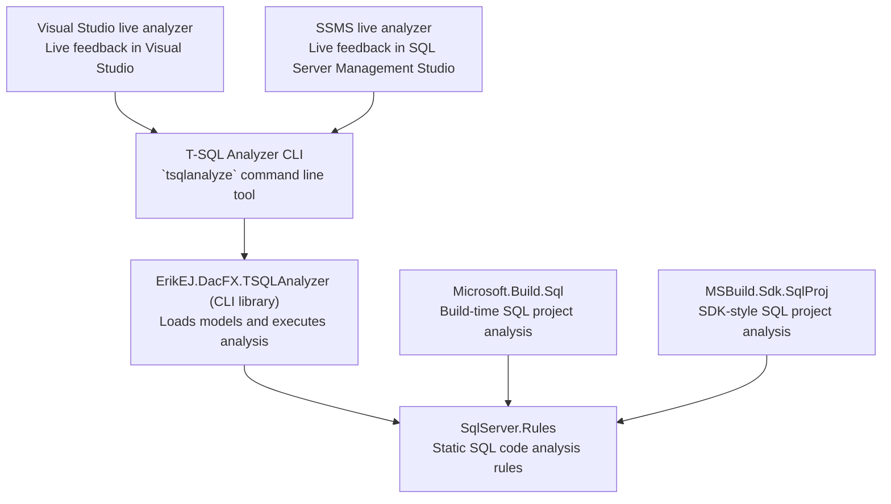

[marketplace]: <https://marketplace.visualstudio.com/items?itemName=ErikEJ.TSqlAnalyzer>
[vsixgallery]: <http://www.vsixgallery.com/extension/SqlAnalyzer.abc6ba2-edd5-4419-8646-a55d0a83f7ff/>

# Static Analysis Rule-sets for SQL Projects

 [](https://www.nuget.org/packages/ErikEJ.DacFX.SqlServer.Rules) 

## Overview

A library of SQL best practices implemented as more than 130 [database code analysis rules](https://erikej.github.io/dacfx/codeanalysis/sqlserver/2024/04/02/dacfx-codeanalysis.html) checked at build time.

The rules can be added as NuGet packages to SQL Database projects:
- **Modern SDK-style projects**: [MSBuild.Sdk.SqlProj](https://github.com/rr-wfm/MSBuild.Sdk.SqlProj) and [Microsoft.Build.Sql](https://github.com/microsoft/DacFx)
- **Classic .sqlproj**: Legacy SSDT projects with automatic configuration through MSBuild props/targets (Visual Studio 2017+ required)

For a complete list of the current rules we have implemented see [here](docs/readme.md).

## Component Stack



## Usage

The latest version is available on NuGet

```sh
dotnet add package ErikEJ.DacFX.SqlServer.Rules
```

### Modern SDK-style Projects

You can read more about using and customizing the rules in the [readme here](https://github.com/rr-wfm/MSBuild.Sdk.SqlProj?tab=readme-ov-file#static-code-analysis)

### Classic .sqlproj Projects

The NuGet package now supports classic .sqlproj files through MSBuild props and targets. Simply add the package reference to your project:

**Using PackageReference** (Visual Studio 2017+):
```xml
<ItemGroup>
  <PackageReference Include="ErikEJ.DacFX.SqlServer.Rules" Version="5.0.0" />
</ItemGroup>
```

**Using packages.config**:
```powershell
Install-Package ErikEJ.DacFX.SqlServer.Rules
```

Code analysis will automatically run during build. No manual installation of DLLs required!

For more details on classic .sqlproj support, see the [investigation documentation](investigations/issue-564-classic-sqlproj-nuget.md).

## Command line tool - T-SQL Analyzer CLI

This repository also contains a .NET command line tool, that uses the rule sets.

You can use it to analyze SQL scripts, or SQL Database projects, and output the results in a variety of formats, including XML, and JSON.

You can also use the tool as a MCP Server with GitHub Copilot with VS Code and Visual Studio, allowing you to get feedback on your SQL code using GitHub Copilot Chat.

The T-SQL Analyzer MCP Server supports quick installation across multiple development environments. Choose your preferred client below for streamlined setup:

| Client | One-click Installation | MCP Guide |
|--------|----------------------|-------------------|
| **VS Code** | [](https://vscode.dev/redirect/mcp/install?name=tsqlanalyzer&config=%7B%22name%22%3A%22tsqlanalyzer%22%2C%22command%22%3A%22dnx%22%2C%22args%22%3A%5B%22ErikEJ.DacFX.TSQLAnalyzer.Cli%22%2C%22--yes%22%2C%22--%22%2C%22-mcp%22%5D%7D) | [VS Code MCP Official Guide](https://code.visualstudio.com/docs/copilot/chat/mcp-servers) |
| **Visual Studio** | [](https://vs-open.link/mcp-install?%7B%22name%22%3A%22tsqlanalyzer%22%2C%22type%22%3A%22stdio%22%2C%22command%22%3A%22dnx%22%2C%22args%22%3A%5B%22ErikEJ.DacFX.TSQLAnalyzer.Cli%22%2C%22--yes%22%2C%22--%22%2C%22-mcp%22%5D%7D) | [Visual Studio MCP Official Guide](https://learn.microsoft.com/visualstudio/ide/mcp-servers) |

Read more in the dedicated [readme file](https://github.com/ErikEJ/SqlServer.Rules/blob/master/tools/SqlAnalyzerCli/readme.md)

## Visual Studio extension - T-SQL Analyzer

This repository also contains a Visual Studio extension, that uses the rule sets.

You can run live analysis of your SQL Database projects in Visual Studio, and get the results in the Error List window.

Download the extension from the [Visual Studio Marketplace][marketplace]
or get the [CI build][vsixgallery]

Read more in the dedicated [readme file](https://github.com/ErikEJ/SqlServer.Rules/blob/master/tools/SqlAnalyzerVsix/readme.md)

## Solution Organization

`.github` - GitHub actions

`docs` - markdown files generated from rule inspection with the DocsGenerator unit test

`Solution Items` - files relating to build etc.

`src`

- `SqlServer.Rules` - This holds the rules derived from `SqlCodeAnalysisRule`

`test`

- `SqlServer.Rules.Tests` - a few test to demonstrate unit testing of rules
- `TestHelpers` - shared test base classes

`tools`

- `SqlAnalyzerCli` - a command line tool to run rules against a SQL Project
- `SqlAnalyzerVsix` - a Visual Studio extension to run rules against a SQL Project
- `ErikEJ.DacFX.TSQLAnalyzer` - library and NuGet package for running rules against SQL scripts and reporting results. Used by `SqlAnalyzerCli`
- `SqlServer.Rules.Generator` - a quick console app to report on all rules in a SQL Project.
- `SqlServer.Rules.Report` - Library for evaluating a rule and serializing the result.

`sqlprojects`

- `AW` - AdventureWorks schema SQL Project for rules validation
- `TestDatabase` - a small SQL Database Project with some rule violations
- `TSQLSmellsTest` - a SQL Database Project with some rule violations
