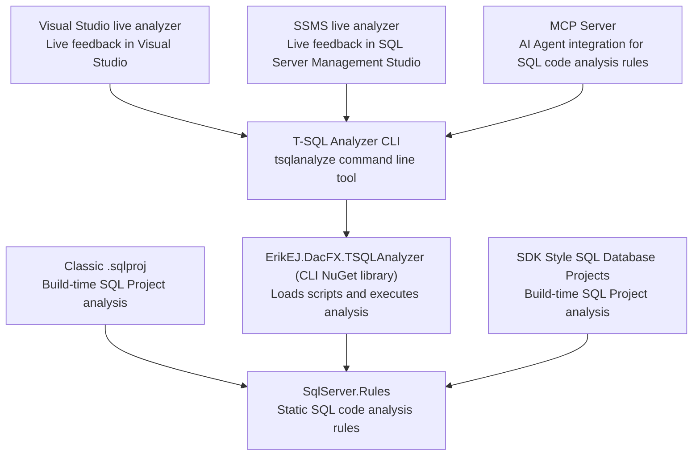

[marketplace]: https://marketplace.visualstudio.com/items?itemName=ErikEJ.TSqlAnalyzer
[ssmsmarketplace]: https://ssmsgallery.azurewebsites.net/extension/TSqlAnalyzerSsms.f1322c34-dfaa-4842-8933-b439626da91d
[vsixgallery]: http://www.vsixgallery.com/extension/SqlAnalyzer.abc6ba2-edd5-4419-8646-a55d0a83f7ff/

# Static Analysis Rule-sets for SQL Projects

 [](https://www.nuget.org/packages/ErikEJ.DacFX.SqlServer.Rules) 

## Overview

A library of SQL best practices implemented as over 140 [database code analysis rules](https://erikej.github.io/dacfx/codeanalysis/sqlserver/2024/04/02/dacfx-codeanalysis.html) checked at build time.

The rules can be added as NuGet packages to SQL Database projects:
- **Modern SDK-style projects**: [MSBuild.Sdk.SqlProj](https://github.com/rr-wfm/MSBuild.Sdk.SqlProj) and [Microsoft.Build.Sql](https://github.com/microsoft/DacFx)
- **Classic .sqlproj**: Legacy SSDT projects (Visual Studio 2017+ required)

For a complete list of the current rules we have implemented see [here](docs/readme.md).

## Component Stack



## Usage

The latest version is available on NuGet

```sh
dotnet add package ErikEJ.DacFX.SqlServer.Rules
```

### Modern SDK-style Projects

The rules are available as a NuGet package that can be added to your SQL Database project. The rules will run during build, and report any issues in the Error List window.

You can read more about using and customizing the rules in the [docs here](https://rr-wfm.github.io/MSBuild.Sdk.SqlProj/docs/static-code-analysis.html)

### Classic .sqlproj Projects

You can download and manually use the rules with Visual Studio and "classic" SQL Database projects, as described in my [blog post here](https://erikej.github.io/dacfx/codeanalysis/sqlserver/2024/04/02/dacfx-codeanalysis.html#addrules).

## Command line tool - T-SQL Analyzer CLI

This repository also contains a .NET command line tool that uses the rule set.

You can use it to analyze SQL scripts or SQL Database projects and output the results in a variety of formats, including XML and JSON.

You can also use the tool as an MCP Server with GitHub Copilot in VS Code and Visual Studio, allowing you to get feedback on your SQL code using GitHub Copilot Chat.

The T-SQL Analyzer MCP Server supports quick installation across multiple development environments. Choose your preferred client below for streamlined setup:

| Client | One-click Installation | MCP Guide |
|--------|----------------------|-------------------|
| **VS Code** | [](https://vscode.dev/redirect/mcp/install?name=tsqlanalyzer&config=%7B%22name%22%3A%22tsqlanalyzer%22%2C%22command%22%3A%22dnx%22%2C%22args%22%3A%5B%22ErikEJ.DacFX.TSQLAnalyzer.Cli%22%2C%22--yes%22%2C%22--%22%2C%22-mcp%22%5D%7D) | [VS Code MCP Official Guide](https://code.visualstudio.com/docs/copilot/chat/mcp-servers) |
| **Visual Studio** | [](https://vs-open.link/mcp-install?%7B%22name%22%3A%22tsqlanalyzer%22%2C%22type%22%3A%22stdio%22%2C%22command%22%3A%22dnx%22%2C%22args%22%3A%5B%22ErikEJ.DacFX.TSQLAnalyzer.Cli%22%2C%22--yes%22%2C%22--%22%2C%22-mcp%22%5D%7D) | [Visual Studio MCP Official Guide](https://learn.microsoft.com/visualstudio/ide/mcp-servers) |

Read more in the dedicated [readme file](https://github.com/ErikEJ/SqlServer.Rules/blob/master/tools/SqlAnalyzerCli/readme.md)

## Visual Studio extension - T-SQL Analyzer

This repository also contains a Visual Studio extension that uses the rule set.

Run live analysis of your SQL scripts in Visual Studio and get the results in the Error List window.

Download the extension from the [Visual Studio Marketplace][marketplace]
or get the [CI build][vsixgallery]

Read more in the dedicated [readme file](https://github.com/ErikEJ/SqlServer.Rules/blob/master/tools/SqlAnalyzerVsix/readme.md)

## SQL Server Management Studio extension - T-SQL Analyzer

This repository also contains a SQL Server Management Studio extension that uses the rule set.

Run live analysis of your SQL scripts in SQL Server Management Studio and get the results in the Error List window.

Download the latest build of this extension from the [SSMS VSIX Gallery][ssmsmarketplace]

Read more in the dedicated [readme file](https://github.com/ErikEJ/SqlServer.Rules/blob/master/tools/SqlAnalyzerSsms/readme.md)
