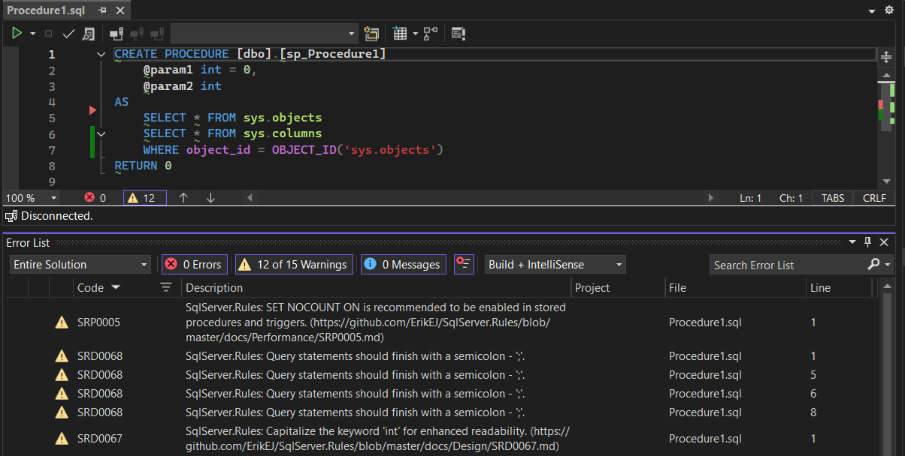
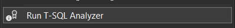

[marketplace]: https://marketplace.visualstudio.com/items?itemName=ErikEJ.TSqlAnalyzer
[vsixgallery]: http://www.vsixgallery.com/extension/SqlAnalyzer.abc6ba2-edd5-4419-8646-a55d0a83f7ff/
[repo]:https://github.com/ErikEJ/SqlServer.Rules

# T-SQL Analyzer

### Live Code Analysis for MSBuild.Sdk.SqlProj and Microsoft.Build.Sql SQL Database projects

[](https://github.com/ErikEJ/SqlServer.Rules/actions/workflows/visx.yml)


Download this extension from the [Visual Studio Marketplace][marketplace]
or get the [CI build][vsixgallery]

----------------------------------------

Analyze your SQL object creation scripts as you type, and get suggestions for improvements based on best practices. The analyzer has over [140 rules](https://github.com/ErikEJ/SqlServer.Rules/blob/master/docs/readme.md) covering performance, security, maintainability, and more.



The extension will respect any rule configuration you have in your SQL project, including whether analysis is enabled, SQL version and rule suppression.

```xml
<Project Sdk="MSBuild.Sdk.SqlProj/3.2.0">
  <PropertyGroup>
    <TargetFramework>net8.0</TargetFramework>
    <SqlServerVersion>Sql170</SqlServerVersion>
    <RunSqlCodeAnalysis>True</RunSqlCodeAnalysis>
    <CodeAnalysisRules>-SqlServer.Rules.SRD0006;-Smells.*</CodeAnalysisRules>
  </PropertyGroup>
</Project>
```

The extension also adds a menu item under `Tools` to run the T-SQL Analyzer tool against the currently open SQL script in the editor.



The extension works with both SQL Server and Azure SQL Database projects based on [MSBuild.Sdk.SqlProj](https://github.com/rr-wfm/MSBuild.Sdk.SqlProj) or [Microsoft.Build.Sql](https://github.com/microsoft/DacFx/tree/main/src/Microsoft.Build.Sql).

> The extension depends on the T-SQL Analyzer CLI tool, which is installed as a .NET global tool. If you haven't installed the tool yet, you can do so by running the following command in a terminal:

```bash
dotnet tool install -g ErikEJ.DacFX.TSQLAnalyzer.CLI
```

## How can I help?
If you enjoy using the extension, please give it a ★★★★★ rating on the [Visual Studio Marketplace][marketplace].

Should you encounter bugs or have feature requests, head over to the [GitHub repo][repo] to open an issue if one doesn't already exist.

Another way to help out is to [sponsor me on GitHub](https://github.com/sponsors/ErikEJ).

If you would like to contribute code, please fork the [GitHub repo][repo] and submit a pull request.
